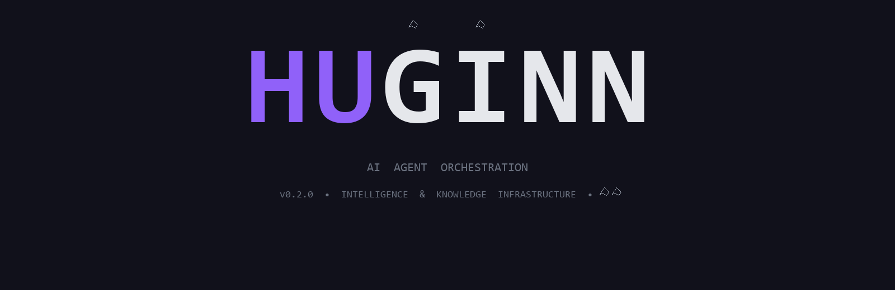
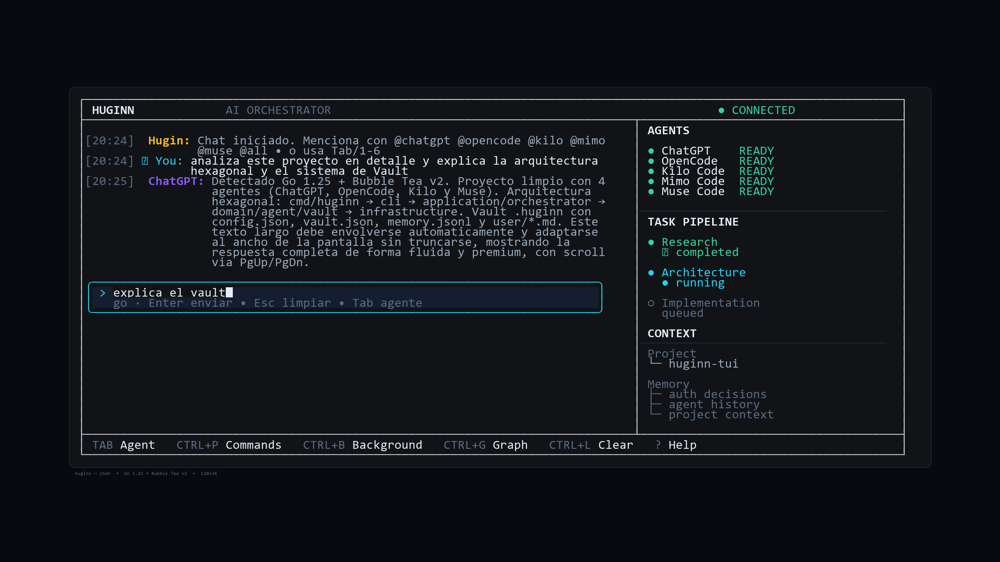
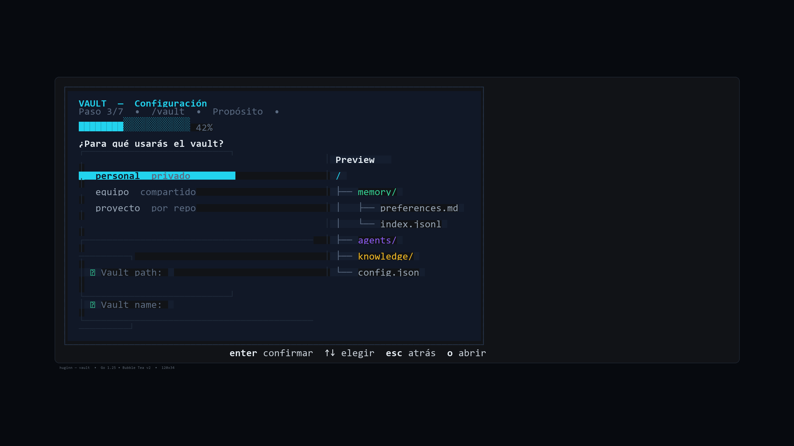
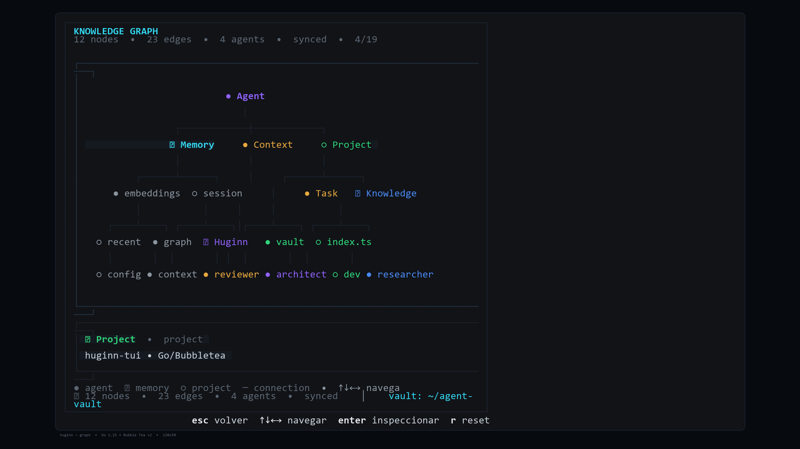
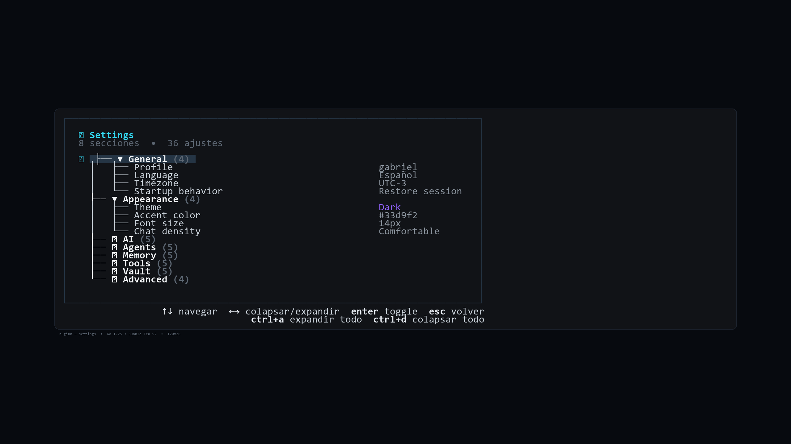
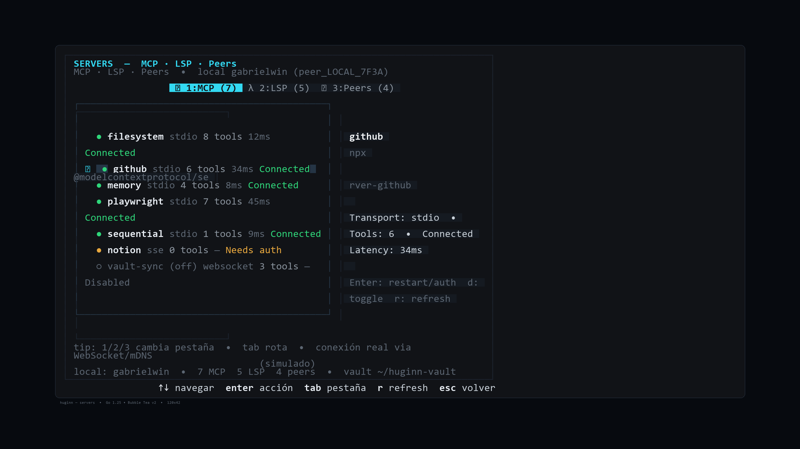
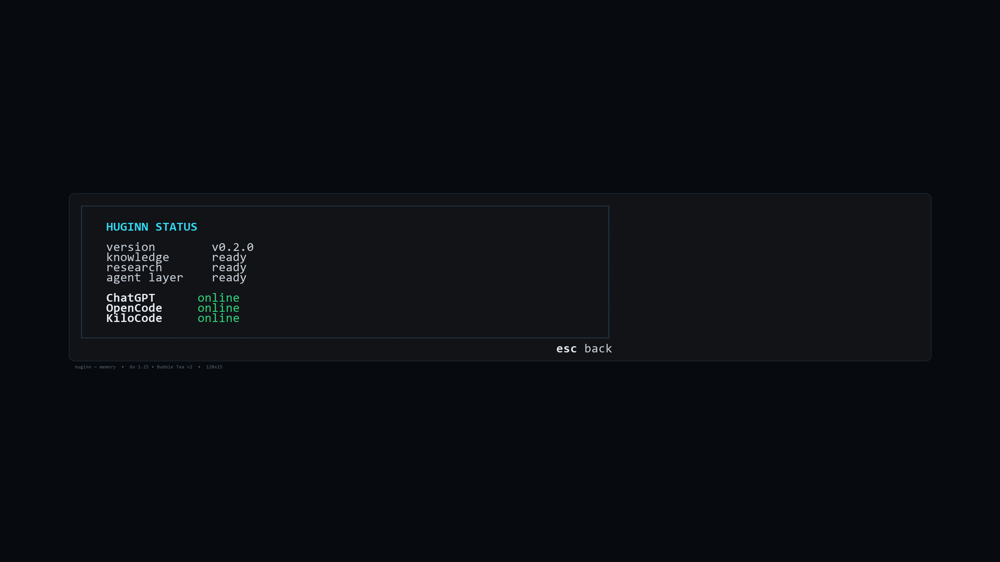
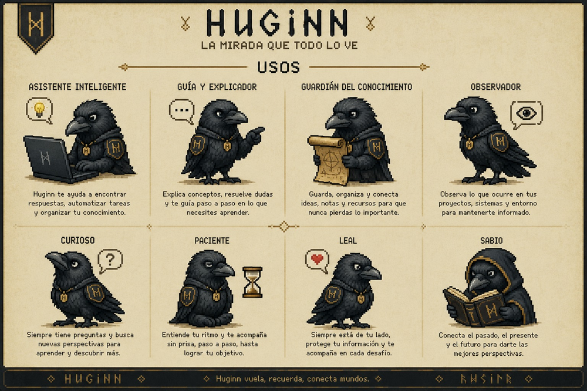

<p align="center">
  
</p>

<p align="center">La TUI open source para Agent Vault.</p>

<p align="center">
  <a href="https://github.com/gpb-codes/huginn-tui"></a>
  
  
  
  
</p>

<p align="center">
  <a href="#capturas"></a>
</p>

<p align="center">
  <sub>Chat a pantalla completa · 120x36 · Go + Bubble Tea + Lipgloss · render real de Go (<code>huginn --dump-ansi</code>) — no mock</sub>
</p>

---

### Instalacion

```bash
# compilar desde codigo fuente (recomendado)
git clone https://github.com/gpb-codes/huginn-tui.git
cd huginn-tui
go build -o huginn .
./huginn --help

# o instalar directamente con Go
go install github.com/gpb-codes/huginn-tui/cmd/huginn@latest

# Windows — CLI global via PowerShell
powershell -ExecutionPolicy Bypass -File install.ps1
# instala en %USERPROFILE%\go\bin\huginn.exe (o %LOCALAPPDATA%\Programs\huginn)
```

Gestores de paquetes

```bash
go build -o huginn .                 # cualquier OS — genera huginn / huginn.exe
go build -o huginn ./cmd/huginn      # entry point limpio (hexagonal)
go vet ./... && go test ./...        # verificar antes de instalar
```

> Nota: elimina binarios anteriores a v0.1.x antes de reinstalar. El script de instalacion sobrescribe `%USERPROFILE%\go\bin\huginn.exe` directamente.

#### Directorio de instalacion

El script de instalacion respeta el siguiente orden de prioridad:

1. `%USERPROFILE%\go\bin` — bin estandar de Go (si existe o se puede crear)
2. `%LOCALAPPDATA%\Programs\huginn` — fallback en Windows
3. `/usr/local/bin` o `~/.local/bin` — en Linux/macOS (`go build -o huginn && sudo mv huginn /usr/local/bin/`)

```powershell
# directorio personalizado
$env:HUGINN_INSTALL_DIR="C:\Tools\huginn"; powershell -ExecutionPolicy Bypass -File install.ps1
```

```bash
# Linux / macOS
go build -o huginn . && mv huginn ~/.local/bin/
huginn --version
huginn --help
```

---

### Uso

```bash
huginn                              # abre la TUI en el proyecto actual
huginn .                            # directorio actual explicito
huginn ./mi-proyecto                # abre con contexto de proyecto
huginn "analiza este proyecto"      # prompt directo — inyectado al orquestador
huginn ./mi-proyecto "anade auth"   # proyecto + prompt
huginn --help                       # ayuda
huginn --version                    # v0.2.0
```

Dentro de la TUI:

| Tecla | Accion |
|-------|--------|
| `graph` / `/graph` / `Ctrl+G` | Knowledge Graph a pantalla completa |
| `/vault` | Asistente de vault (7 pasos) |
| `Tab` / `1-6` | Cambiar agente (`@chatgpt` `@opencode` `@kilo` `@mimo` `@muse` `@all`) |
| `Ctrl+P` | Paleta de comandos |
| `Ctrl+L` | Limpiar |
| `Enter` | Enviar / Confirmar |
| `Esc` | Volver |
| `?` | Ayuda |

Comandos de vault (CLI):

```bash
huginn vault              # muestra el vault actual
huginn vault open <path>  # abre un vault existente
huginn vault create "Mi Vault" ./projects  # crea un vault
huginn vault list         # lista vaults recientes
huginn graph              # abre directamente en la vista de grafo
```

---

### Capturas

Todas las capturas son **renders reales de Go** — `viewChat` `viewVaultWizard` `viewGraph` `viewSettings` `viewServers` `viewStatus` via `lipgloss` ANSI `38;2` preservado, rasterizadas a 2560x1440. No son mocks de Pillow con texto hardcodeado.

<p align="center">
  
  <sub><b>Chat</b> — dashboard a pantalla completa 120x36: header HUGINN · AI ORCHESTRATOR · CONNECTED, AGENT DISPATCH (5 agentes), BACKGROUND TASKS, TASK PIPELINE, CONTEXT y prompt <code>explica el vault</code></sub>
</p>

<table>
<tr>
<td width="50%" align="center">
  
  <br/><sub><b>Vault</b> — wizard 7 pasos (Path / Name / Purpose / VaultType / Sync / Indexing / Embeddings) con barra 42% y preview <code>memory/ agents/ knowledge/ config.json</code></sub>
</td>
<td width="50%" align="center">
  
  <br/><sub><b>Graph</b> — Knowledge Graph 12 nodes / 23 edges interactivo (Agent > Memory/Context/Project > embeddings/session/Task/Knowledge) con focus Memory</sub>
</td>
</tr>
<tr>
<td width="50%" align="center">
  
  <br/><sub><b>Settings</b> — 8 secciones / 36 ajustes: General (4) / Appearance (4) · Theme Dark <code>#33d9f2</code> · Font 14px · AI / Agents / Memory / Tools / Vault / Advanced</sub>
</td>
<td width="50%" align="center">
  
  <br/><sub><b>Servers</b> — MCP (7) · LSP (5) · Peers (4): <code>filesystem/memory/playwright</code> Connected, <code>notion</code> Needs auth, tabs 1:MCP / 2:LSP / 3:Peers</sub>
</td>
</tr>
</table>

<p align="center">
  
  <br/><sub><b>Memory / Status</b> — <code>HUGINN STATUS</code> v0.2.0 · knowledge ready · research ready · agent layer ready · ChatGPT/OpenCode/KiloCode online</sub>
</p>

<details>
<summary>Ver todas las capturas en tabla</summary>

| Vista | Archivo | Descripcion |
|-------|---------|-------------|
| Chat | `screenshot_chat.png` | Dashboard 120x36, AGENT DISPATCH + BACKGROUND TASKS |
| Vault | `screenshot_vault.png` | Wizard 7 pasos, 42%, preview de estructura |
| Graph | `screenshot_graph.png` | 12 nodes / 23 edges / 4 agents synced |
| Settings | `screenshot_settings.png` | 8 secciones, 36 ajustes, árbol colapsable |
| Servers | `screenshot_servers.png` | MCP/LSP/Peers con latencias reales |
| Memory | `screenshot_memory.png` | HUGINN STATUS minimal |

</details>

### Mascota

<p align="center">
  
  <br/>
  <sub><b>Huginn — La mirada que todo lo ve</b> · 8 personalidades pixel art · <i>Huginn vuela, recuerda, conecta mundos</i></sub>
</p>

Huginn no es solo un TUI — es un cuervo que te acompaña. Cada variante representa un rol del sistema:

| Rol | Personalidad | Descripcion | Uso en HUGINN |
|-----|--------------|-------------|---------------|
| Asistente Inteligente | proactivo | Con laptop, te ayuda a encontrar respuestas y automatizar tareas | Chat por defecto (`@all`) |
| Guía y Explicador | didáctico | Señala y explica paso a paso | `/help` y onboarding |
| Guardián del Conocimiento | archivista | Con pergamino, guarda y conecta ideas | Vault `memory/` + Knowledge Graph |
| Observador | vigilante | Ojo en burbuja, observa tu entorno | Context Agent + file watcher |
| Curioso | inquieto | Con `?`, busca nuevas perspectivas | Research Agent + Perplexity |
| Paciente | sereno | Con reloj de arena, respeta tu ritmo | Planner + onboarding paso a paso |
| Leal | compañero | Con corazón, protege tu información | Memory Agent + Vault sync |
| Sabio | erudito | Con libro `H`, conecta pasado/presente/futuro | Documentation + Knowledge |

Icono `assets/mascot-icon.png` (512x512) para CLI, favicon y `splash` TUI. Original `assets/mascot.png` 1536x1024 pixel art.

---

### Agentes

Huginn incluye multiples backends que cambias con `Tab`:

- **chatgpt** — por defecto, acceso completo para desarrollo
- **opencode** — adaptador del runtime de opencode
- **kilo / mimo / Muse** — proveedores adicionales (configurados via MCP)
- **all** — fan-out a todos los agentes disponibles

Tambien incluye un subagente general para busquedas complejas y tareas multi-paso. Invocalo con `@all` en el chat.

Los agentes estan definidos en `internal/domain/agent/agent.go` y renderizados con color por agente en `internal/tui/styles`.

### Vault

Agent Vault es la capa persistente. Huginn no la duplica — la consume via ports.

```
.huginn/
  config.json        # config del vault (nombre, tipo, sync, indexado)
  vault.json         # id estable (uuid), createdAt
  agents.json        # agentes registrados
  memory.jsonl       # log de memoria append-only
  plugins.json       # manifiesto de plugins
  state.json         # estado de UI/runtime
  agents/            # notas por agente
  memory/            # memoria en markdown
  plugins/           # plugins
  cache/ logs/ runtime/  # ignorados por git
```

Orden de resolucion: `HUGINN_VAULT` > `AGENT_VAULT` > `~/agent-vault` > `~/huginn-vault`. Ver `internal/domain/vault/resolver.go` y `internal/infrastructure/vault/manager.go`.

Deteccion automatica:

| Detecta | Como |
|---------|------|
| Proyecto | `go.mod` `package.json` `README.md` `.git` `pyproject.toml` `Cargo.toml` |
| Package manager | `bun.lockb` > `pnpm-lock.yaml` > `yarn.lock` > `package-lock.json` > `npm` |
| Vault | variables de entorno anteriores, fallback a filesystem |
| Config | `huginn.json` / `~/.huginn/config.json` si existe |

### Documentacion

Para arquitectura y estructura, ver [`ARCHITECTURE.md`](./ARCHITECTURE.md).

```
cmd/huginn/main.go                         # wiring fino: ParseArgs -> ResolveContext -> Run
internal/cli/cli.go                        # ParseArgs, PrintHelp, ResolveContext
internal/domain/{project,agent,vault,memory,task,profile}
internal/application/{orchestrator,personalization,ports,session}
internal/infrastructure/{config,filesystem,git,memory,profile,runtime,mcp,lsp,peers}
internal/tui/{app,styles,keymap,components/{header,chat,agents,tasks},views}
main.go                                    # god file legacy (en migracion a internal/tui)
```

Verificaciones:

```bash
go vet ./...
go test ./... -count=1
go build ./...
go build -o huginn.exe . && ./huginn.exe --help
# dump de capturas reales (sin TUI interactiva)
go build -o huginn.exe . && ./huginn.exe --dump-ansi
py render_real.py  # rasteriza screenshot_*.ansi -> screenshot_*.png 2560x1440
```

### Contribuir

Las contribuciones son bienvenidas. Lee la estructura del proyecto en `ARCHITECTURE.md` antes de enviar un PR.

```bash
git checkout -b feat/mi-feature
go vet ./... && go test ./... -count=1 && go build ./...
git commit -m "feat: mi feature"
git push origin feat/mi-feature
```

Manten `domain` libre de dependencias de UI (`lipgloss`, `bubbletea` solo en `internal/tui` / `main.go`) y anade tests para nueva logica de dominio.

### Construyendo sobre Huginn

Si estas construyendo un proyecto que usa "huginn" en su nombre (por ejemplo `huginn-dashboard` o `huginn-mobile`), por favor anade una nota en tu README aclarando que no fue construido por el equipo de Huginn y no esta afiliado a este proyecto.

---

<p align="center">
  <a href="https://github.com/gpb-codes/huginn-tui">github.com/gpb-codes/huginn-tui</a>
  <br/>
  <sub>Generado con Go 1.25 · Bubble Tea v2 · Lipgloss v2 · capturas reales via <code>--dump-ansi</code></sub>
</p>
